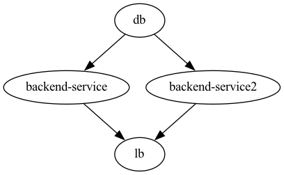
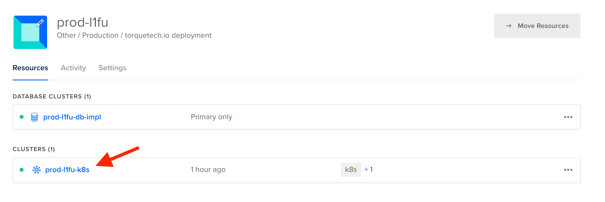
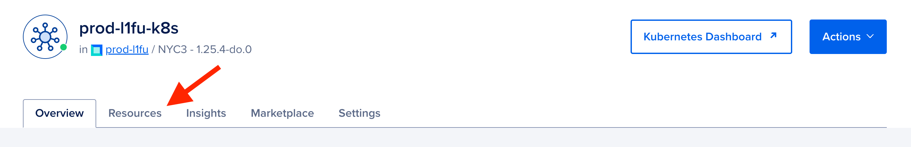
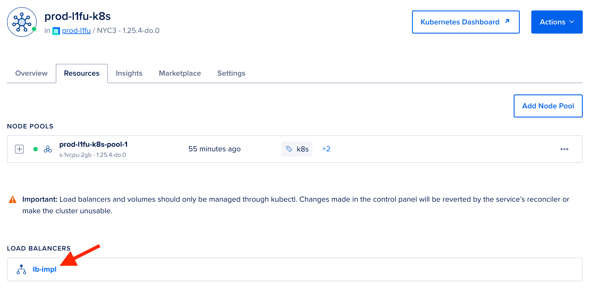
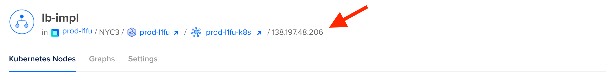

# Quick Start - Kubernetes on DigitalOcean 

This Torque workspace can serve as a good foundation for further Torque Framework-enabled development. You can use Torque to build and deploy it both locally and on a cloud provider. This Quick Start workspace uses Kubernetes with DigitalOcean for the cloud deployment.

The workspace has a few components best understood by looking at Architecture DAG (Directed Acyclic Graph). DAG has a load balancer, two backend API services, and a PostgreSQL database.



## Prerequisites

### 1. Software Setup

To run the DAG locally using Docker or to deploy it to DigitalOcean, you'll need to ensure you have these installed and up-to-date:

1. Git
2. Python 3.10+ — To check your version run `python3 --version`. For installation instructions visit [Python 3 Installation & Setup Guide](https://realpython.com/installing-python/) or [Managing Multiple Python Versions With pyenv](https://realpython.com/intro-to-pyenv/).
3. pipx — For installation instructions visit [Torque Docs](https://docs.torque.cloud/installation#pipx-installation)
4. Docker with Docker Compose — To install Docker (with Docker Compose) visit [docker.com/get-started website](https://www.docker.com/get-started) and follow the instructions. And make sure Docker is up & running by running `docker info` or by checking a visible Docker image on the MacOS status bar.
5. Torque CLI - Follow instruction from [Torque Docs](https://docs.torque.cloud/installation/#installing-torque-cli)


### 2. DigitalOcean Account and Personal Access Token

To deploy the DAG to the DigitalOcean, you have to take care of a few things. The list includes:

1. You need a DigitalOcean account.
2. You need to obtain a DigitalOcean Personal Access Token with read and write scopes.

Regardless of whether you have a DigitalOcean account, we strongly recommend you create a new DigitalOcean account for this guide because:

1. We want to avoid anything happening to your production DigitalOcean account.
2. DigitalOcean supports only one Container Registry per account, and the `torque.container_registry.V1Provider` supports only the creation of a new registry. Re-using the existing registry is currently not supported.

To open a new DigitalOcean account, you can use Torque's referral link and get $200 worth of credits:<br/>[**Use Torque's Referral**](https://m.do.co/c/fae088e63d68>)


_(You can learn more about DigitalOcean's referral program at [DigitalOcean Referral Program](https://www.digitalocean.com/referral-program).)_

---
  **⚠️ Important: How much will this cost me?**

  When you sign up for DigitalOcean, it will ask you for your credit card as a part of the account verification. If you use our referral link and get $200 worth of credits, **your credit card won't be charged for following this "Getting Started" guide.**

  On the other hand, here is an estimate of how much does it cost to deploy the DAG from this guide to DigitalOcean and to keep it up and running for a whole month: 

    =========================================  ==========
    Service                                    Cost
    =========================================  ==========
    Container Registy (Starter)                $0/mo
    Kubernetes (1 Basic Node)                  $12/mo      
    Load Balancer (starts from)                $12/mo
    Managed Database (PostgreSQL Basic)        $15/mo
    **Total if kept running for 1 month.**     **$39/mo**
    =========================================  ==========

  It takes only one command to take all DigitalOcean provisioned resources down. You do not need to worry about dangling resources on DigitalOcean after finishing this tutorial. 

  Estimates were calculated from DigitalOcean's pricing page: [www.digitalocean.com/pricing](https://www.digitalocean.com/pricing)

---

Next, you'll need your DigitalOcean Personal Access Token with the read and write scopes. With your Personal Access Token, the DigitalOcean provider can deploy your DAG to DigitalOcean. Please follow the official guide:
[docs.digitalocean.com/reference/api/create-personal-access-token/](https://docs.digitalocean.com/reference/api/create-personal-access-token/)

Now that you have a DigitalOcean Personal Access Token, you can use it for the `DO_TOKEN` environment variable used by the Torque CLI.

## Run locally

**⚠️ Important:**
Before proceeding to the deployment instructions make sure you have prerequisites satisfied. For the following commands to work, you need to have Docker installed and running on your laptop.

```bash
torque deployment build local
```

```bash
torque deployment apply local
```

The `apply` command for `local` deployment executes the `docker compose` command for the Docker images built during the `build` command. This created and started Docker containers.

To check the running app execute:

```bash
curl -H "Host: api.example.com" http://localhost:8080/backend-service
```

The output should be the current database time. 

```bash
Database time: 2023-01-09T10:49:30.536818Z%
```

## Deployment to DigitalOcean

**⚠️ Important:**
Before proceeding to the deployment instructions make sure you have prerequisites satisfied. For the following commands to work, you need to have Docker installed and running on your laptop.


## Deploying to DigitalOcean

Once you have your DigitalOcean Personal Access Token, use this command to set `DO_TOKEN` environment variable run:

```bash
export DO_TOKEN=<dop_v1_replace_with_your_personal_access_token>
```

After you set `DO_TOKEN`, we are ready to build and apply `prod` deployment:

```bash
torque deployment build prod
```

```bash
torque deployment apply prod
```

The `apply` command will be waiting for all instances to be created on DigitalOcean and it might take up to half an hour until everything is up and running. But you do not need to worry about it, providers will do all the work. 

After the `apply` command finishes, you can visit your [DigitalOcean Dashboard](https://cloud.digitalocean.com/) to check created K8s cluster. DigitalOcean does a great job of explaining how to set up the `kubectl config` and use it to observe your K8s cluster. 

**⚠️ Important:**
The same rules for managing infrastructure with Infrastructure as Code solutions apply: **do not change anything manually**. If you need to change something, do it through `torque` commands. 

The IP address of your K8s cluster load balancer can be found at the [DigitalOcean Dashboard](https://cloud.digitalocean.com/):

1. Open your `prod-*` project from the [DigitalOcean Dashboard](https://cloud.digitalocean.com/).

  

1. Select the `prod-*-k8s` cluster.
  
  

1. Select the *Resources* tab. 
  
  

1. Select `lb-impl` balancer inside the *Load Balancers* group.

  

1. The IP address will be at the end of the navigation breadcrumbs. Click on the IP address to copy it to your clipboard.
  
  

Now that you have the IP address, you can run:

```bash
curl -H "Host: api.example.com" https://<IP address>/backend-service -k
```

**☝️ Note:**
It might take up to a minute for the container to spin up for the first time. So if you get a `503 Service Temporarely Unavailable` error from Nginx, wait a bit and try again.

The output should be the current database time. 

```bash
Database time: 2023-01-09T10:49:30.536818Z%
```

### Deleting

`torque deployment delete` command strips down the deployed objects. In the case of `prod` deployment, the `delete` command will strip down all deployed services from DigitalOcean. You want to execute the `delete` command before abandoning this tutorial to make sure all provisioned resources are deleted from the DigitalOcean account.

```bash
torque deployment delete prod
```
